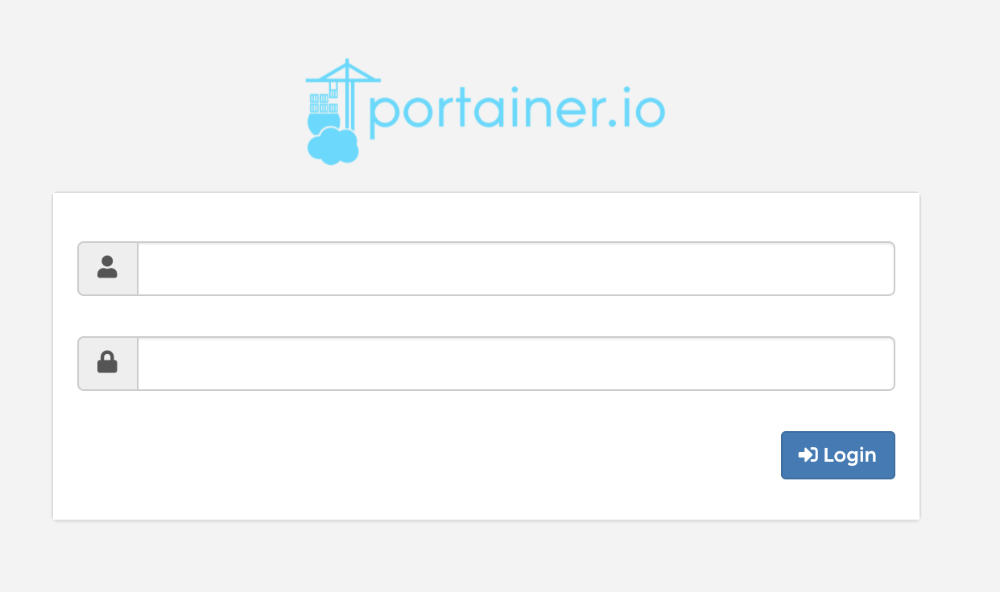
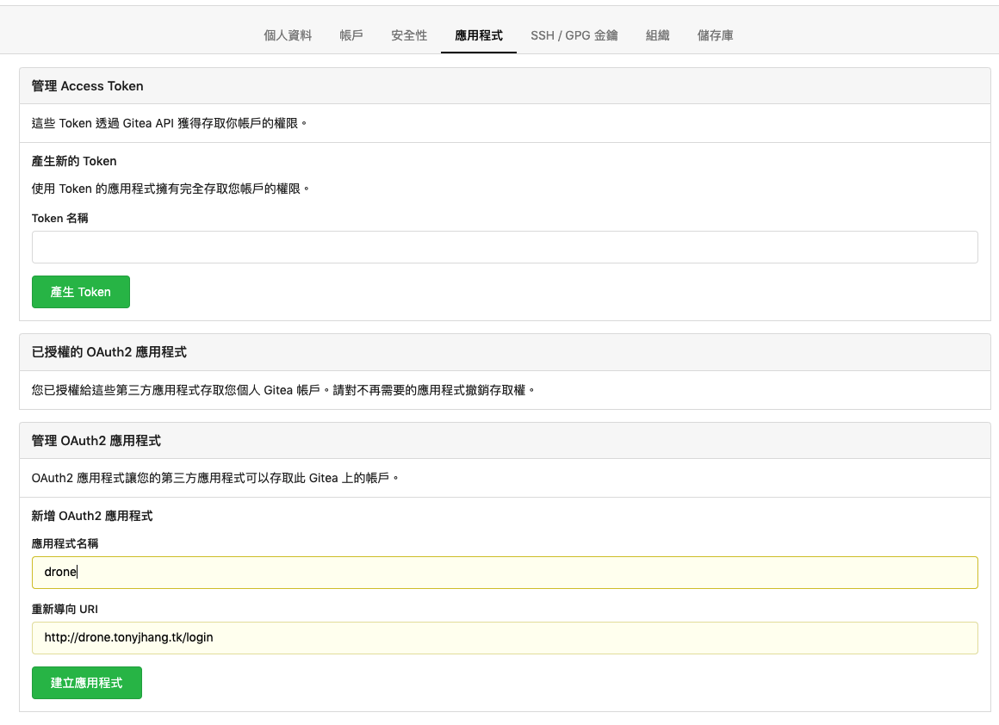
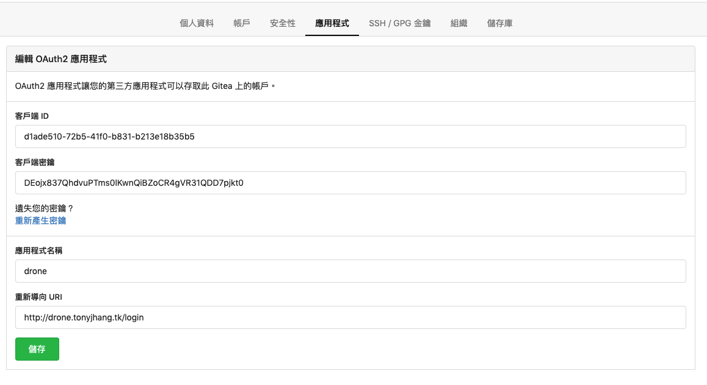
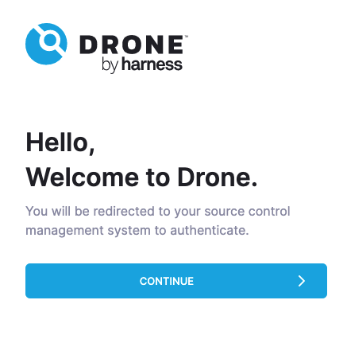
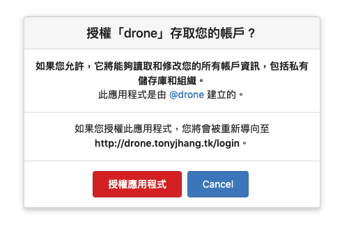
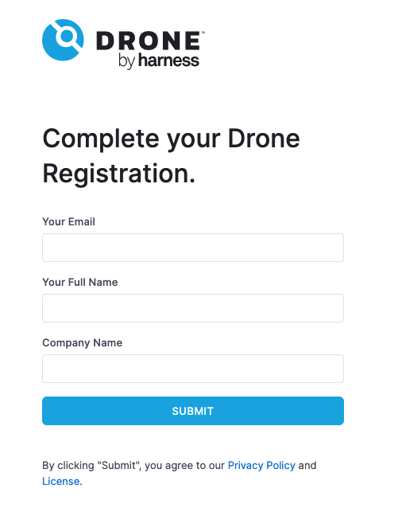
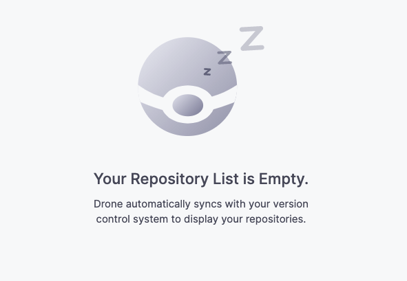
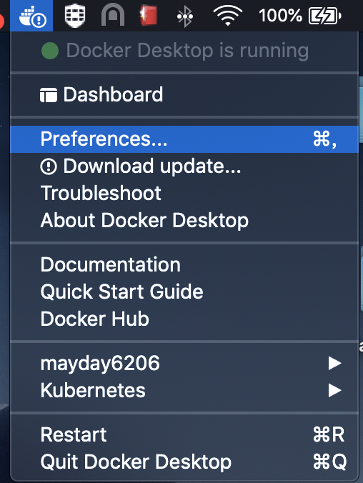
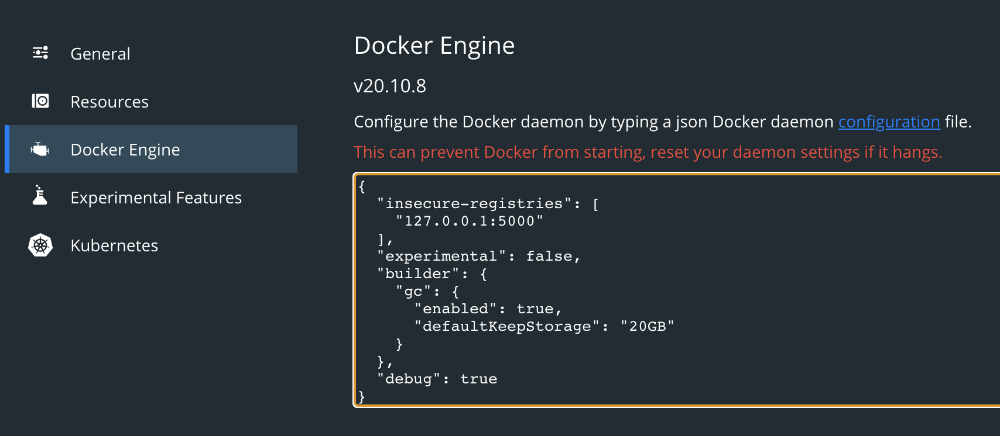
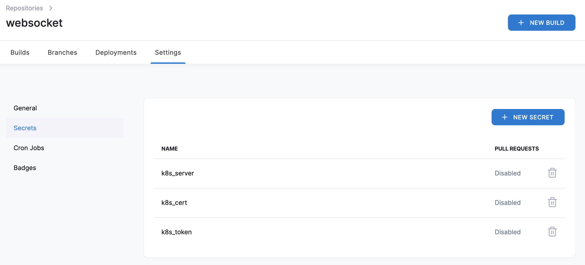

# local-develop

## 本機開發CI/CD流程建置方式

### 建立Portainer

建立 Portainer 主要是為了方便管理 Container

建立本機持久化儲存空間，以避免 portainer 重啟後資料遺失

```
mkdir $HOME/portainer
```

啟動 portainer 並將本機儲存空間與 /data 進行掛載 mapping

```
docker run -d -p 9000:9000 \
--restart always \
-v /var/run/docker.sock:/var/run/docker.sock \
-v $HOME/portainer:/data \
--name portainer \
portainer/portainer:1.24.2
```

測試

```
http://127.0.0.1:9000
```



### 建置 local-develop CI/CD 流程

本機開發選定的開源軟體分別為：Gitea、Drone、docker-registry、docker-registry-frontend

依照以下步驟進行建立

1. 確認 install.sh 中 k3d_storage 路徑是否需要調整
2. 建立 sh install.sh
3. 加入 hosts 到 /etc/hosts

```
# local_develop
127.0.0.1 drone.tonyjhang.tk
127.0.0.1 gitea.tonyjhang.tk
127.0.0.1 registry.tonyjhang.tk
127.0.0.1 registry-frontend.tonyjhang.tk
```

4. 連線 Gitea → 初始組態不變，只需設定一個管理員帳號，然後進行安裝
```
http://gitea.tonyjhang.tk:3000/
```

5. 建立 Drone 專用帳號 → 登入該帳號 → 將 Drone 專用帳號填入 `.env` 檔案內

- drone_admin=drone

> 建議建立一個 static account，例如：drone 帳號

6. 於該頁面設定 Drone 應用程式授權資訊，重新導向URI 請填入 `http://drone.tonyjhang.tk/login`



7. 將 客戶端 ID / 客戶端密鑰 填入 `.env` 檔案內

- DRONE_GITEA_CLIENT_ID → 客戶端 ID
- DRONE_GITEA_CLIENT_SECRET → 客戶端密鑰
- DRONE_RPC_SECRET → 理論上可以不需要更改，這是 drone 與 drone-agent 間的認證而已

> 如果真的想更改 DRONE_RPC_SECRET的值 可以使用該指令來產生 `openssl rand -hex 16`



8. 調整 Gitea 的 port，在 docker-compose 上 port-mapping 1022:22，我們本機使用 1022 與 Gitea 的 22port 做通訊，所以需要調整一下 Gitea 的 app.ini 檔案，可以參照 `.env` 內 volume_gitea 的位置，預設在 `~/Documents/local_develop/gitea`，app.ini 的絕對路徑為 `~/Documents/local_develop/gitea/gitea/conf/app.ini`。

調整下列設定，這樣才能讓 web 頁面產生 repo ssh URL 時能夠正常帶入 1022 port

```
SSH_PORT = 22 → 1022
```

9. 上述完成後，執行下述指令

```
# 將第一次啟動的 docker-compose 關掉
docker-compose -f docker-compose-pre.yaml down

# 啟動另外一個完整版的 docker-compose
docker-compose up -d
```

10. 連線 Drone 進行剛剛在 Giea 上設定的授權驗證

點擊「CONTINUE」


點擊「授權應用程式」


直接點擊「SUBMIT」


成功授權後就會自動進到該頁面


11. 因為 docker-registry 並沒有提供 UI 介面，這邊有使用其他人開發出來的前端頁面來進行 UI 顯示，可以連線到
```
http://registry-frontend.tonyjhang.tk:1180/
```

以上到此基礎建置已經完成，日後要管理容易只需要使用 docker-compose.yaml 來進行 down & up 即可

### 補充說明

如果本機拉取自建的docker-registry時出現以下錯誤

```
http: server gave HTTP response to HTTPS client
```

可以在下圖處加入該段設定

```
"insecure-registries": [
  "127.0.0.1:5000"
],
```





### CI/CD 流程建置 & k3d Ingress 的使用

將 helloworld 該專案放到桌面(or 其他地方)，Gitea 建立相同名稱的 REPO，並在將他推上進行版控
- Gitea 可以建立自己的帳號，記得將公鑰放上去
- 將 helloworld 專案新增 drone 為協作者(可寫權限)，這樣 Drone 網頁才能看到該專案

開啟 Drone 頁面，並點選 sync，此時就可以看到剛剛建立的專案，這時候我們需要設定一些發佈到 k3d 的連線授權所需資訊

1. 此時需要將 source 內，該檔案 drone-deploy-account.yaml 部署到 k3d 叢集內
2. 紀錄 ca.crt 與 token

 - kubectl get secret [Secret_Name] -o yaml | egrep 'ca.crt:|token:' → 此處紀錄 ca.crt

```
kubectl get secret drone-deploy-token-xl2fv -o yaml | egrep 'ca.crt:|token:'
```

  - kubectl describe secrets [ServiceAccount-token-*] → 此處紀錄 token


```
kubectl describe secrets drone-deploy-token-xl2fv
```

3. 回到 Drone 設定剛剛的授權驗證，依照 websocket 專案內 `.drone.yml` 描述檔進行對應設定

```
k8s_server=https://k3d-mycluster-serverlb:6443
k8s_cert=填入剛才的ca.crt
k8s_token=填入剛才的token
```



4. 將 helloworld 該包程式碼內的 k8s.yaml 部署到 K3d 內，此時會發現映像檔抓不到 → 正常現象，因為還沒有映像檔

5. 調整一下 helloworld 內的 README.md 再推上 Gitea 此時就會觸發 Drone，會根據 `.drone.yml` 來進行 CI/CD 流程，此時可以打開 Drone 頁面來觀察，等待 CI/CD 結束後，可以回到 K3d 去下 `kubectl get pod`，此時就可以發現 Pod 順利啟動了，在 docker-registry 上也會多一個映像檔 `registry.tonyjhang.tk:5000/helloworld-master:latest`
